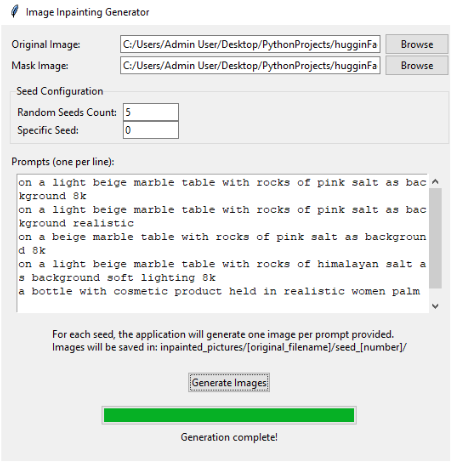
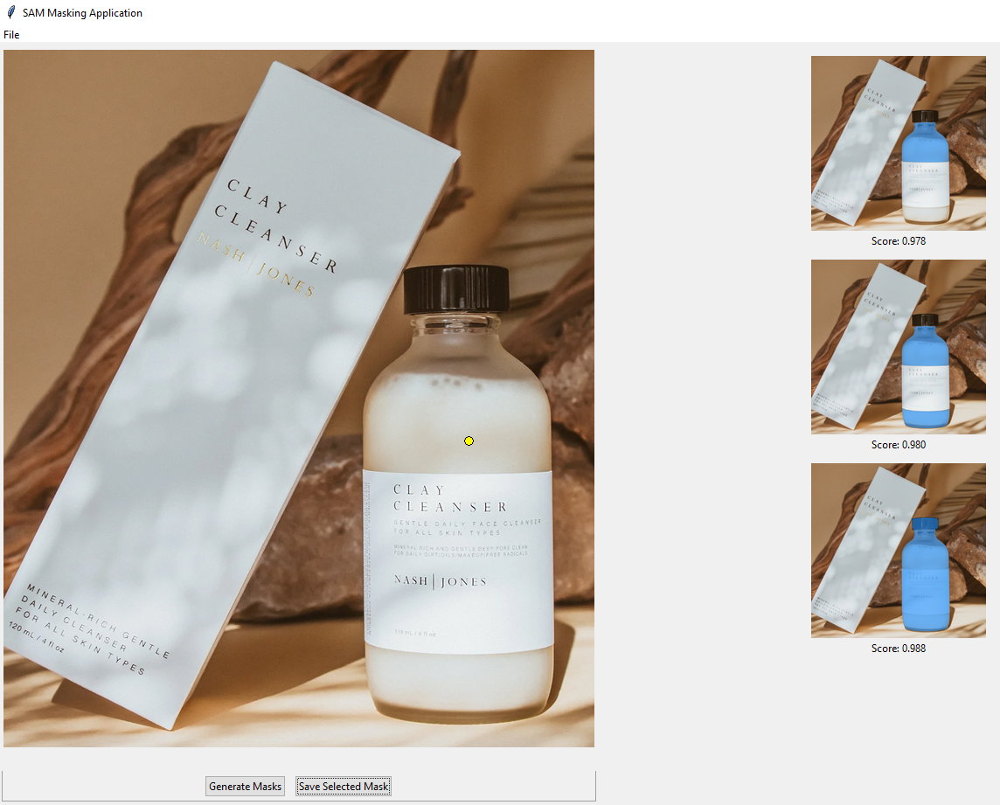
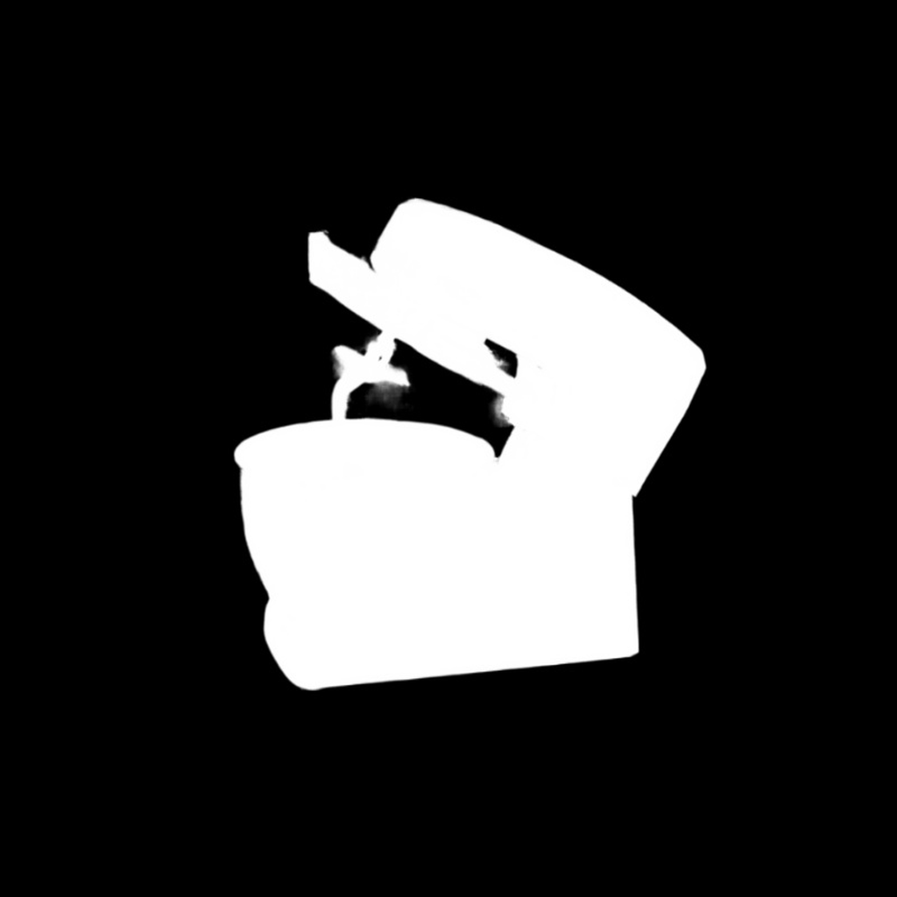
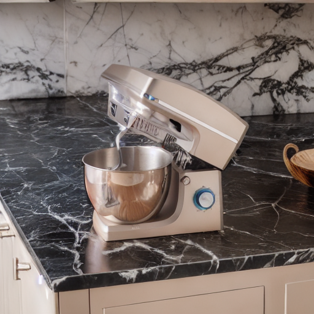

# E-commerce Product Background Generator

This project is a Python-based solution designed to generate customized backgrounds for e-commerce product images. It comprises two main components:

1. **`stable_diffusion_v_1.2.py`**:  
   This script generates high-quality product backgrounds using the `"runwayml/stable-diffusion-inpainting"` model, sourced from Hugging Face.

2. **`masks_application.py`**:  
   This script leverages Facebook's SAM (Segment Anything Model) to create precise masks for the products, enabling seamless integration of generated backgrounds.

---

## Features

- **Customizable Backgrounds**: Create professional backgrounds for product images with ease.  
- **Automatic Mask Generation**: Use state-of-the-art segmentation models for accurate masking.  
- **User-Friendly Interface**: Intuitive UIs for both image generation and mask application.

---

## Getting Started

### Prerequisites

- **Python Version**: Ensure you have Python 3.12 installed.  
- **Dependencies**: Install the required libraries using the `requirements.txt`.

### Installation

1. **Clone the Repository**:  
   ```bash
   git clone https://github.com/CristianBabalauCSUM/Ecommerce-Background-Generator.git
   cd <repository_name>

2. **Install Requirements**:  
   Run the following command to install the dependencies:  
   pip install -r requirements.txt

3. **Download the SAM Model**:  
   The SAM model file (sam_vit_h_4b8939.pth) should be located in the root directory of the project. It is already included in the repository.  
   However, if needed, you can manually download it from:  
   https://huggingface.co/spaces/abhishek/StableSAM/blob/main/sam_vit_h_4b8939.pth

---

## Usage

### Running the Applications

1. **Image Generation (stable_diffusion_v_1.2.py)**  
   Execute the script to generate backgrounds for e-commerce products:  
   python stable_diffusion_v_1.2.py


2. **Mask Application (masks_application.py)**  
   Run this script to generate product masks:  
   python masks_application.py

### Interfaces

Screenshots of the interfaces will be shown here:  
1. Interface for stable_diffusion_v_1.2.py:  
     

2. Interface for masks_application.py:  
     

---

## Results

Output examples of generated backgrounds and masks will be displayed here.  

### Example Results  

Original Image:  
  

Generated Mask:  
  

Final Product with Background (512 x 512):  
 
Prompt :

on a empty table in a kitchen room with marble walls 8k_144

---

Enjoy creating stunning e-commerce product images effortlessly! 🎨
